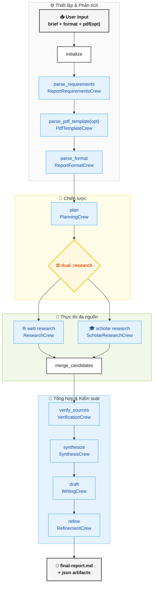

# Researcher Agents

## 1. Mục tiêu

He thong tao bao cao nghien cuu tu brief + format yeu cau, voi luong multi-agent theo `CrewAI Flow`, co dual retrieval (`web` + `Google Scholar`) va co the doc PDF mau de suy ra format.

## 2. Flow tổng quan




## 3. Kien truc

### 3.1 Orchestration Layer
- `CrewAI Flow` la bo dieu phoi trung tam.
- Flow methods chay theo event chain `@start` -> `@listen`.
- Diem chia nhanh duy nhat la `dual_research`, chay song song 2 lane bang `ThreadPoolExecutor`.

### 3.2 State Layer
- `ResearchReportState` giu toan bo trang thai run:
  - input: `brief`, `format_instructions`, `format_pdf_path`
  - contracts: `requirements`, `pdf_template`, `format_spec`, `research_plan`, `outline`
  - retrieval: `web_candidates`, `scholar_candidates`, `merged_candidates`
  - verified/synthesis/draft/final paths

### 3.3 Crew/Agent Layer
- `ReportRequirementsCrew`: chuan hoa yeu cau bao cao.
- `PdfTemplateCrew`: doc PDF mau, trich heading/structure.
- `ReportFormatCrew`: tao `ReportFormatSpec` tu format text + mau PDF.
- `PlanningCrew`: tao cau hoi, search agenda, outline.
- `ResearchCrew`: open-web retrieval.
- `ScholarResearchCrew`: scholar retrieval.
- `VerificationCrew`: dedupe + verify source.
- `SynthesisCrew`: tao evidence table + findings.
- `WritingCrew`: draft markdown report.
- `RefinementCrew`: refine de dam bao format + quality.

### 3.4 Tool Layer
- `web_search.py`: open-web provider.
- `google_scholar_search.py`: scholar provider.
- `pdf_template_parser.py`:
  - bat buoc backend MinerU (`opendatalab/MinerU2.5-Pro-2604-1.2B`)
  - neu thieu runtime/model se dung flow va bao loi huong dan tai model
- `fetch_source.py`: fetch metadata/excerpt.
- `source_registry.py`: normalize URL + luu verified source registry.

### 3.5 Runtime Modes
- **Live mode**: dung LLM/providers that, khi co credentials. Mac dinh **khong fallback** trong live mode; loi se dung flow.
- **Deterministic mode**: dung logic fallback de test/smoke on dinh khi `USE_LIVE_CREWS=false`.

## 4. Tech Stack

- Language/runtime: `Python 3.13`
- Orchestration: `crewai`, `crewai-tools`
- Data contracts: `pydantic`, `pydantic-settings`
- HTTP/provider calls: `httpx`
- PDF parsing:
  - model path (required): `mineru-vl-utils` + `transformers` + `torch`
- Test: `pytest`
- Packaging: `pyproject.toml` editable install

## 5. Environment

The project is set up to run inside `venv`.

Create virtual environment and activate venv:

```powershell
python -m venv venv
./venv/Scripts/activate
```

Install requirements

```powershell
python -m pip install -e .[dev]
```

If you want Gemini as the report LLM provider, install the Gemini extra:

```powershell
python -m pip install -e .[dev,gemini]
```

CrewAI tries to write under user-local storage by default. This project redirects those paths into the workspace through runtime env setup.

## 6. Run

``` python 
python -m research_report_flow.main --brief-file examples/input_brief.md --format-file examples/report_format.md
```

Optional PDF template input:

```powershell
python -m research_report_flow.main --brief-file examples/input_brief.md --format-file examples/report_format.md --format-pdf-file path\to\sample-report.pdf
```

The command prints the final report path. Artifacts are written under `output/<run-id>/`.

## Output Artifacts

- `requirements.json`
- `format-spec.json`
- `pdf-template.json` when `--format-pdf-file` is provided
- `research-plan.json`
- `outline.json`
- `web-candidates.json`
- `scholar-candidates.json`
- `merged-candidates.json`
- `verified-sources.json`
- `synthesis.json`
- `draft.md`
- `refinement.json`
- `final-report.md`

## Live Providers

- Open-web search: `TAVILY_API_KEY`
- Google Scholar-compatible retrieval: `SERPAPI_API_KEY`
- LLM reasoning : `Gemini` or `OpenRouter`

## .env format

Web-search API
- Open-web search (Tavily): `TAVILY_API_KEY`
- Tavily depth control: `TAVILY_SEARCH_DEPTH` (`basic`, `advanced`, `fast`, `ultra-fast`)
- Google Scholar-compatible retrieval: `SERPAPI_API_KEY`

If using GEMINI_API
- Research model selector: `gemini-2.5-pro`
- Research LLM (Gemini project-specific key): `RESEARCH_REPORT_GEMINI_API_KEY`

If using Openrouter free tier model
- Using live crew: `USE_LIVE_CREWS=true`
- Research model selector: `RESEARCH_REPORT_MODEL=openrouter/openai/gpt-oss-20b:free`
- Research LLM (OpenRouter project-specific key): `RESEARCH_REPORT_OPENROUTER_API_KEY=your_openrouter_key`
- Optional OpenRouter base URL override: `RESEARCH_REPORT_OPENROUTER_BASE_URL=https://openrouter.ai/api/v1`


Set-up for free tier
- Retry controls for transient provider failures: `API_RETRY_ATTEMPTS`, `API_RETRY_BACKOFF_SECONDS`
- LLM request spacing (useful for strict free-tier quotas): `LLM_MIN_INTERVAL_SECONDS`
- Fast failover switch for live LLM stages: `FAST_DEGRADE_ON_LIVE_FAILURE`
- Allow fallback ngay ca khi live mode bi loi: `ALLOW_LIVE_FALLBACK` (mac dinh `false`)
- Retrieval pressure controls: `SEARCH_RESULT_LIMIT`, `SCHOLAR_RESULT_LIMIT`, `MAX_AGENDA_ITEMS`, `DUAL_RESEARCH_PARALLEL`
- Free-tier safe profile switch: `FREE_API_MODE=true`


## PDF Template Parsing

The format lane can optionally read a sample report PDF and infer section structure before building `ReportFormatSpec`.

- Default model target: `opendatalab/MinerU2.5-Pro-2604-1.2B`
- Runtime backend: `MinerU` only (no fallback backend)
- If MinerU runtime/model is not available, flow stops and reports setup/download instructions

If you want the MinerU backend, install its runtime pieces in the existing `.venv`:

```powershell
python -m pip install "mineru-vl-utils[transformers]" transformers torch
```

The model card and quick-start are here:
- https://huggingface.co/opendatalab/MinerU2.5-Pro-2604-1.2B

Optional environment variables for Hugging Face download/auth:

- `HUGGINGFACE_HUB_TOKEN` for authenticated model downloads when needed
- `HF_HOME` to relocate Hugging Face cache
## Note

If `USE_LIVE_CREWS=false`, the flow uses deterministic logic for crew stages.  
If `USE_LIVE_CREWS=true` and provider lỗi, flow sẽ **dừng** (product-like), trừ khi bạn bật `ALLOW_LIVE_FALLBACK=true`.
